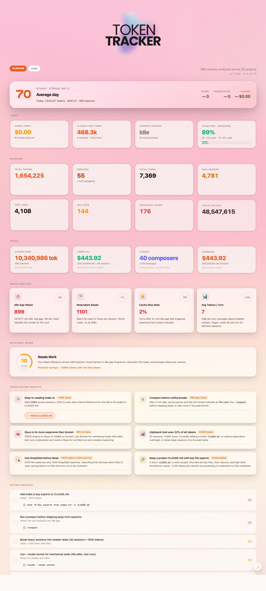
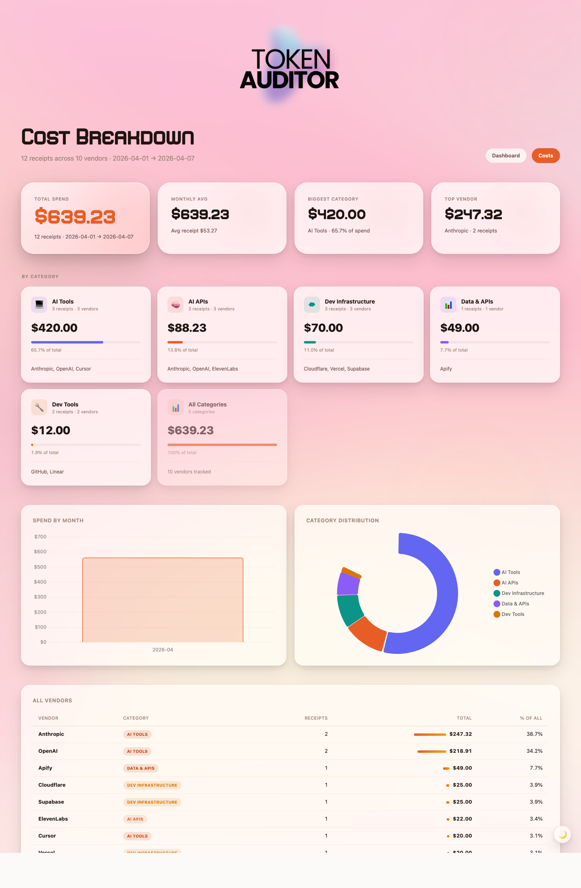
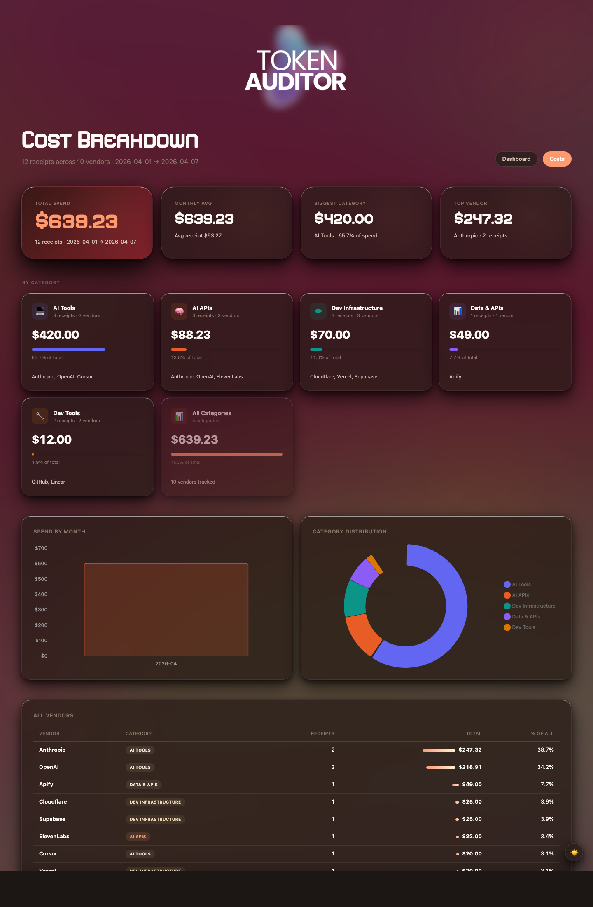

<div align="center">
  
  
</div>

# Token Auditor

A local dashboard for tracking what your AI coding tools actually cost you, and a tax-time helper for writing them off.

It reads Claude Code session logs, Codex CLI rollouts, Cursor exports, and (optionally) billing emails from Gmail. Then it shows you the damage in one place: how many tokens you burned today, which projects ate the most, where you're wasting cache, what your monthly spend looks like across every AI vendor you use, and how much of that is deductible business expense.

Everything runs on your machine. No API keys to Anthropic or OpenAI, no telemetry, no cloud sync. The only network call it makes is to Gmail's API (with your OAuth token) when you ask it to scan receipts, and even that uses regex parsing, not an LLM.

## Screenshots

### Dashboard

Today's usage at the top, totals across all time, then waste analysis and concrete suggestions for what to fix.



### Cost breakdown

Receipts grouped by vendor and category. Hero numbers up top show monthly spend, average receipt size, and total receipts captured. Pulled from Gmail or added manually.



Dark mode:



### Native menu bar widget

A frosted-glass macOS panel that lives in the menu bar. Shows your efficiency score, tokens today, cost today, Codex rate limits, and any active Claude Code sessions with live burn rate. Written in Swift with NSVisualEffectView, SF Rounded fonts, settings to hide sections you don't care about.

Run `swift menubar.swift` to launch it.

## What it tracks

| Source | What it reads | What you get |
|---|---|---|
| Claude Code | `~/.claude/projects/**/*.jsonl` | Per-session token counts (input, output, cache create, cache read), turn counts, tool uses, model used, project, idle gaps, redundant file reads |
| Codex CLI | `~/.codex/sessions/**/rollout-*.jsonl` | Cost per session, the live `rate_limits` block (5h primary window + 7d secondary window with `used_percent`), reasoning token counts |
| Cursor | manual JSON export from the IDE | Composer message counts as a usage proxy (Cursor doesn't expose token counts) |
| Gmail | invoice emails via OAuth | Receipts from Anthropic, OpenAI, Cursor, Cloudflare, Vercel, Railway, Supabase, GitHub, Linear, Apify, ElevenLabs, and ~20 more vendors |

## How the analyzers work

### `analyze.py` (Claude Code)

Walks every JSONL file under `~/.claude/projects/`, parses each line as a session event, and aggregates by project. It extracts the four token types Anthropic bills separately (`input_tokens`, `output_tokens`, `cache_creation_input_tokens`, `cache_read_input_tokens`) and computes:

- **Cache hit rate** = `cache_read / (cache_read + input)`. Above 80% means most requests reuse the prompt cache. Below 50% means you're rebuilding context constantly.
- **Idle gaps** = turns where the gap between user message and the previous assistant message is over 5 minutes. Each idle gap forces a full cache rebuild on the next turn at roughly 10x the normal cost. The dashboard counts these.
- **Redundant reads** = files that get read 3+ times in the same session. Usually means the file should be in `CLAUDE.md` instead.
- **Average tokens per turn** = total tokens / total turns. A high number (above 8k) signals bloated context.

The output goes to `report.json` which the dashboard fetches.

### `codex_analyze.py` (Codex CLI)

Codex rollouts are JSONL too, but the schema is different. The interesting bit is the `event_msg.payload.rate_limits` block that Codex writes after every API call. It contains both rolling windows:

```
"rate_limits": {
  "primary":   { "used_percent": 11.4, "window_minutes": 300 },   // 5h
  "secondary": { "used_percent": 13.2, "window_minutes": 10080 }  // 7d
}
```

The analyzer takes the most recent value from the most recent session as your "current remaining" and exposes both windows on the dashboard and in the menu bar widget. Cost is computed per-session by summing token counts and applying the published Codex pricing for whichever model the session used.

### `live_monitor.py` (background)

A long-running process that polls `~/.claude/projects/` every few seconds and writes `live.json` with currently-active sessions. A session is "active" if its JSONL was modified in the last N seconds. For each one it computes burn rate (tokens per minute over the last 60 seconds), idle time, and cost so far. The dashboard and menu bar both read this for the live view.

### `snapshot.py` (efficiency score)

Computes a 0–100 score based on three signals:

1. **Redundancy ratio** — what fraction of your reads were redundant
2. **Idle gap ratio** — what fraction of your turns followed a 5+ minute idle gap (each forces a full cache rebuild)
3. **Average tokens per turn** — penalised above 8k

The exact formula is in `snapshot.py`. The score is shown as a colored ring in the dashboard hero card and in the menu bar widget. Below 50 means you have meaningful room to reduce spend without changing what you're working on.

## Tax write-offs

If you're a freelancer, contractor, single-member LLC, or running a small business in the US, your AI tools are deductible business expenses. The IRS treats them the same as any other software subscription: ordinary and necessary, fully deductible against business income on Schedule C (or whatever your entity files).

The hard part is usually proving the spend at tax time. Stripe receipts are scattered across vendor emails, none of them export to a clean format, and by April you can't remember which were business and which were personal. Token Auditor solves that.

### What `tax_report.py` does

```bash
python3 tax_report.py                      # Current year
python3 tax_report.py --year 2025          # Specific year
python3 tax_report.py --quarter 2026-Q1    # Specific quarter (good for estimated taxes)
python3 tax_report.py --month 2026-04      # Single month
python3 tax_report.py --format csv         # CSV only (for your accountant or TurboTax)
python3 tax_report.py --format md          # Markdown only (for your records)
```

It reads `receipts.jsonl`, filters by date range, and writes both:

- A **CSV** with one row per receipt (date, vendor, category, amount, currency, description, email subject) ready to import into TurboTax, QuickBooks, or hand to an accountant
- A **Markdown report** with category totals, vendor totals, and a flat receipt list, formatted to drop into a tax folder or print as backup

Receipts are auto-categorized into IRS-friendly buckets:

| Category | Maps to | Examples |
|---|---|---|
| `ai-api` | Software / API expenses | Anthropic API, OpenAI API, Replicate, ElevenLabs |
| `ai-tool` | Software subscriptions | Claude Pro, ChatGPT Plus, Cursor, Copilot |
| `dev-infra` | Hosting / cloud | Cloudflare, Vercel, Railway, Supabase, Fly.io |
| `dev-tools` | Software subscriptions | GitHub, Linear, Notion, Figma, 1Password |
| `data` | Data acquisition | Apify, scraping APIs, dataset purchases |
| `other` | Misc | Anything tagged manually |

Files are saved under `reports/` so you have a clean audit trail. Original PDF receipts (when Gmail attaches them) are archived under `receipts/YYYY/MM/` with filenames like `2026-04-03-anthropic-200.00.pdf`. If you ever get audited, the whole paper trail is on disk and ready to hand over.

### Real-world numbers

For most solo developers using AI tools heavily, this works out to between $3,000 and $15,000 a year in deductible spend. At a 25% effective tax rate that's $750 to $3,750 you don't owe. The actual amount depends on your bracket and your accountant, but the point is: if you're already spending the money, you might as well document it properly.

**This isn't tax advice.** Talk to a CPA. The tool just makes the data clean enough that the conversation takes 10 minutes instead of an afternoon.

## Receipt scanning without burning tokens

Most "AI receipt scanners" feed every email body through GPT-4 or Claude. That costs real money and is slow. `gmail_oauth_extract.py` does it differently:

1. Connects to Gmail directly via the official Google API using OAuth (no third party)
2. Searches for known vendor sender addresses (`from:invoice+statements@mail.anthropic.com`, `from:billing@tm1.openai.com`, etc.)
3. Extracts the amount with vendor-specific regex (each vendor has a different invoice format, so each gets a tiny parser)
4. Writes the result to `receipts.jsonl` and downloads any PDF attachments

Total LLM spend: zero. A four-month scan of ~100 receipts takes about 30 seconds and uses no API tokens at all. The OAuth scope is `gmail.readonly` so it can never send, delete, or modify anything in your inbox.

You can also drop receipts in manually:

```bash
python3 -c "import receipts; receipts.add(date='2026-04-01', vendor='Anthropic', amount=200.00, category='ai-tool', description='Claude Max')"
```

## Install

```bash
git clone https://github.com/hellomaude/token-auditor.git
cd token-auditor
pip install -r requirements.txt
./start.sh
```

That starts the analyzers and serves the dashboard at `http://localhost:8787/dashboard.html`.

To enable Gmail receipt scanning:

1. Create a Google Cloud project at https://console.cloud.google.com/
2. Enable the Gmail API for it
3. Create OAuth 2.0 credentials (Desktop app type)
4. Download `credentials.json` to this directory
5. `pip install google-auth google-auth-oauthlib google-api-python-client`
6. `python3 gmail_oauth_extract.py` — first run opens a browser for OAuth, saves a token, then scans the last 4 months

To run the menu bar widget (macOS only):

```bash
swift menubar.swift
```

Or for a launchd-managed setup that runs on login, use the plists in `launchd/`.

## Architecture

```
~/.claude/projects/**/*.jsonl  ─┐
~/.codex/sessions/**/*.jsonl   ─┼─→ analyzers ──→ report.json     ─┐
Cursor exports                  ─┘                cursor_report.json├─→ dashboard.html
                                                  codex_report.json │  costs.html
Gmail (via OAuth, no LLM)      ───→ extractor ──→ receipts.jsonl   ─┘   menubar.swift

live_monitor.py                 ───→ live.json                     ─→ live view (dashboard + widget)

receipts.jsonl                  ───→ tax_report.py                 ─→ reports/*.csv  reports/*.md
```

Everything is plain JSON or JSONL on disk. No database, no daemons besides the live monitor and the local HTTP server. You can grep your data, diff your data, back it up by copying a folder.

## What's in here

| File | Does what |
|---|---|
| `analyze.py` | Parses Claude Code JSONL session logs, builds `report.json` |
| `codex_analyze.py` | Parses Codex rollouts, extracts rate limits and costs |
| `cursor_analyze.py` | Reads Cursor composer exports |
| `live_monitor.py` | Background process writing `live.json` with active sessions |
| `snapshot.py` | Computes the efficiency score |
| `gmail_oauth_extract.py` | Direct Gmail API receipt scanner (no LLM, no token cost) |
| `receipts.py` | Receipt store, vendor → category mapper, add/list helpers |
| `tax_report.py` | Generates CSV + Markdown tax reports for any date range |
| `server.py` | Local HTTP server on `:8787` |
| `dashboard.html` | The main dashboard page |
| `costs.html` | Receipts breakdown / spend page |
| `widget.html` | Web version of the menu bar widget |
| `menubar.swift` | Native macOS menu bar app + frosted-glass floating widget |
| `mcp_server.py` | Optional MCP bridge so Claude can answer questions about your usage |
| `launchd/` | Plist files for running everything on login via launchd |

## How it costs you nothing to run

Token Auditor itself doesn't talk to any LLM. The whole pipeline is local file parsing plus a Gmail OAuth call. The cost figures it shows are reconstructed from the JSONL session logs your tools write to disk anyway. No API hits, no extra spend.

The only "AI" it touches is the optional MCP server, which exposes the local data to Claude when you want to ask questions like "what did I spend last week" without leaving your editor. That bit obviously costs whatever the conversation costs on your end.

## Privacy

Nothing leaves your machine. `receipts.jsonl`, `report.json`, `live.json`, `history.jsonl`, and the `receipts/` PDF folder are all in `.gitignore` and stay on local disk. Gmail credentials live in `credentials.json` and `token.json`, also gitignored. The Gmail OAuth scope is read-only so even if a token leaked, it couldn't send or delete email.

If you want to share a dashboard screenshot publicly, the analyzers expose project names. Either rename them in `report.json` before sharing, or use the included demo data scripts to anonymize.

## License

MIT.
